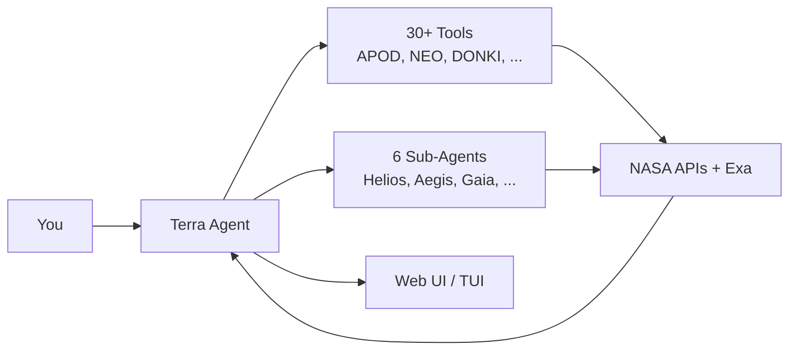

# TerraOrbit

<p align="center">
  
</p>

<p align="center">
  An open-source AI space harness that brings NASA's data to your terminal and browser.
</p>

<p align="center">
  <a href="https://www.npmjs.com/package/terra-orbit"></a>
  <a href="LICENSE"></a>
  <a href="https://bun.sh"></a>
</p>


## Video demo

<p>
<a href="https://www.youtube.com/watch?v=P8luPmEa1QI">TerraOrbit | Demo Video</a>
</p>

<a href="https://www.youtube.com/watch?v=IGyC4X45VKE"></a>


## Try It

```bash
bun add terra-orbit
# or
npm i terra-orbit
```

## Quick Start

**Requires:** Bun v1.x ([install](https://bun.sh))

```bash
# Install
bun add terra-orbit

# Set up environment
cp .env.example .env
# Edit .env → add your NASA_API_KEY and HACK_CLUB_AI_API_KEY
# .env will work in the same dir of the session, if you want it global, add it to ~/.config/terra-orbit/config.json or node_modules/terra-orbit/.env

# Launch
bunx terra-orbit --web   # Web UI
bunx terra-orbit --tui   # Terminal UI
```

## Features

- **7 NASA API integrations** — APOD (Astronomy Picture of the Day), NEO (Near Earth Objects), EPIC (Earth Polychromatic Imaging Camera), DONKI (Space Weather), EONET (Natural Events), TechTransfer (patents & spinoffs), and the NASA Image & Video Library
- **6 specialized AI sub-agents** — Helios (space weather), Aegis (planetary defense), Gaia (Earth observation), Chronos (imagery curation), Prometheus (tech transfer), and Argus (deep web research)
- **Terminal UI** — built with OpenTUI, featuring ASCII art, syntax-highlighted output, and slash commands
- **Web UI** — React 19 dark-themed chat interface with streaming responses, tool call cards, reasoning blocks, and a CRT scan-line aesthetic
- **30+ AI tools** — every NASA endpoint is exposed as a callable tool for the AI agent
- **Web search** — powered by Exa for deep research when NASA APIs lack coverage
- **Multi-step reasoning** — agents can chain tool calls, delegate to sub-agents, and autonomously explore space data

## How It Works



**Why sub-agents?** Each sub-agent has a narrow toolset (e.g. Helios only knows DONKI), which cuts hallucinations on specialized tasks. The tradeoff is latency — every sub-agent call costs an extra LLM round-trip — so the agent avoids delegating trivial lookups.

## Configuration

Create `~/.config/terra-orbit/config.json`:

```json
{
  "NASA_API_KEY": "your-nasa-api-key",
  "HACK_CLUB_AI_API_KEY": "your-hackclub-ai-api-key",
  "MAIN_MODEL": "your-favourite-main-model",
  "SUB_MODEL": "your-favourite-sub-model",
  "PORT": "3000"
}
```

Alternatively, you can use a `.env` file in the working directory.

| Variable | Description |
|---|---|
| `NASA_API_KEY` | NASA API key (required for NASA tools) |
| `HACK_CLUB_AI_API_KEY` | API key for HackClub AI |
| `MAIN_MODEL` | Main AI model |
| `SUB_MODEL` | Sub-agent AI model |
| `PORT` | Web server port (default: 3000) |

Get `NASA_API_KEY` from [NASA Open APIs](https://api.nasa.gov/) and `HACK_CLUB_AI_API_KEY` from [HackClub AI](https://ai.hackclub.com/).

## Development

```bash
bun install
bun run build
```

## Credits

- **[HackClub AI](https://ai.hackclub.com/)** — free LLM proxy powering all AI features
- **[NASA Open APIs](https://api.nasa.gov/)** — space data infrastructure
- **[Vercel AI SDK](https://ai-sdk.dev/)** — agent framework (ToolLoopAgent, streamText)
- **[OpenTUI](https://opentui.com)** — terminal UI framework
- **[Exa](https://exa.ai)** — web search API for deep research
- **[OpenRouter](https://openrouter.ai/)** — model routing

---

[MIT](LICENSE)

