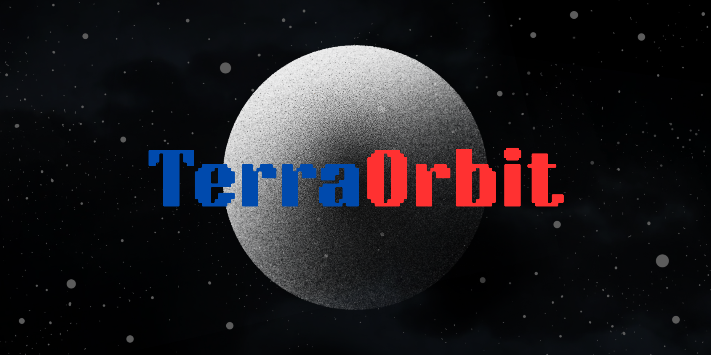
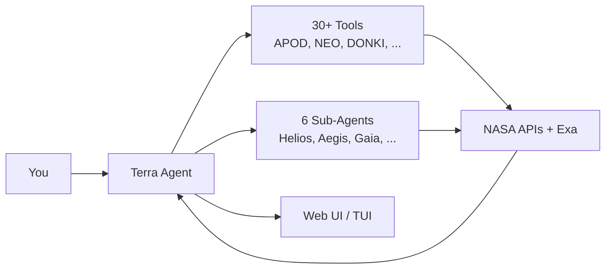

# TerraOrbit

<p align="center">
  
</p>

<p align="center">
  An open-source AI space harness that brings NASA's data to your terminal and browser.
</p>

## Video demo

<p>
<a href="https://www.youtube.com/watch?v=P8luPmEa1QI">TerraOrbit | Demo Video</a>
</p>

<a href="https://www.youtube.com/watch?v=IGyC4X45VKE"></a>


## Quick Start

**Requires:** Bun ([install](https://bun.sh)) or Node.js 18+ ([install](https://nodejs.org/en/download))

```bash
# Install with Bun
bun add -g terra-orbit

# Install with Node.js
npm i -g terra-orbit

# Set up environment
cp .env.example .env
# Edit .env add your NASA_API_KEY and HACK_CLUB_AI_API_KEY
# .env will work in the same dir of the session, if you want it global, add it to ~/.config/terra-orbit/config.json or node_modules/terra-orbit/.env

# Launch with Bun
bunx terra-orbit --web   # Web UI
bunx terra-orbit --tui   # Terminal UI

# Launch with Node.js
npx terra-orbit --web    # Web UI
npx terra-orbit --tui    # Terminal UI

# Launch if it is installed globally
terra-orbit --web        # Web UI
terra-orbit --tui        # Terminal UI
```

## Features

- Terra a specialized AI agent for space exploration.
- 30+ tools for research, including APOD, NEO, DONKI, and more.
- 6 sub-agents for detailed research.
- TUI and WebUI.


## How It Works



## Configuration

Create `~/.config/terra-orbit/config.json`:

```json
{
  "NASA_API_KEY": "your-nasa-api-key",
  "HACK_CLUB_AI_API_KEY": "your-hackclub-ai-api-key",
  "MAIN_MODEL": "your-favourite-main-model",
  "SUB_MODEL": "your-favourite-sub-model",
  "PORT": "8000"
}
```

Alternatively, you can use a `.env` file in the working directory.

| Variable | Description |
|---|---|
| `NASA_API_KEY` | NASA API key (required for NASA tools) |
| `HACK_CLUB_AI_API_KEY` | API key for HackClub AI |
| `MAIN_MODEL` | Main AI model |
| `SUB_MODEL` | Sub-agent AI model |
| `PORT` | Web server port (default: 3000) |

Get `NASA_API_KEY` from [NASA Open APIs](https://api.nasa.gov/) and `HACK_CLUB_AI_API_KEY` from [HackClub AI](https://ai.hackclub.com/).

## Credits

This project wasn't possible without the use of [HackClub AI](https://ai.hackclub.com/) and [NASA Open APIs](https://api.nasa.gov/). Also, [Vercel AI SDK](https://ai-sdk.dev/) that helped me in build the AI harness.

---

This project is licensed under the [MIT](LICENSE) license.

